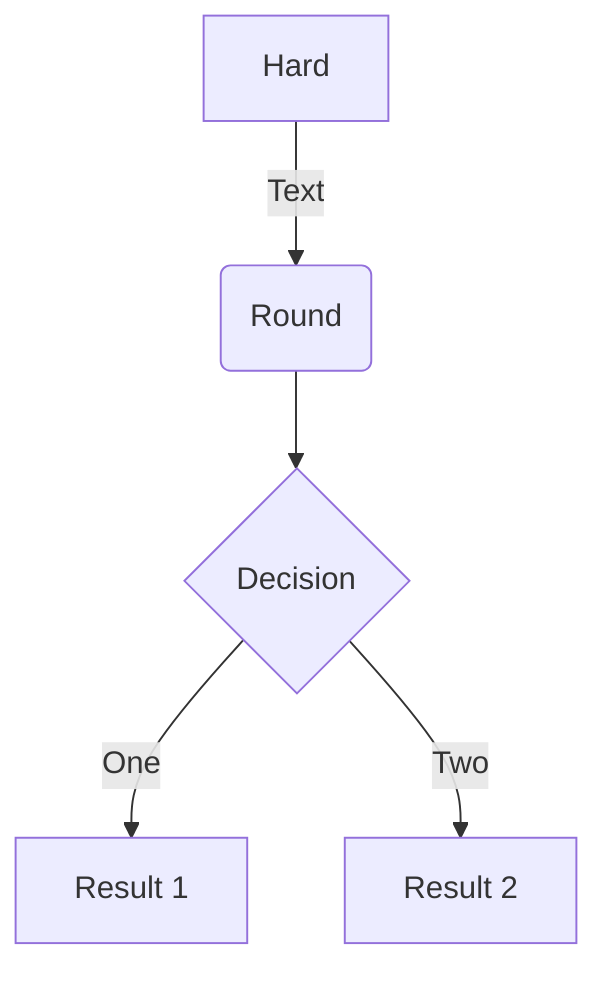

Welcome to [Hexo](https://hexo.io/)! This is your very first post. Check [documentation](https://hexo.io/docs/) for more info. If you get any problems when using Hexo, you can find the answer in [troubleshooting](https://hexo.io/docs/troubleshooting.html) or you can ask me on [GitHub](https://github.com/hexojs/hexo/issues).

<!--more-->

## Quick Start

### Create a new post

``` bash
$ hexo new "My New Post"
```

More info: [Writing](https://hexo.io/docs/writing.html)

### Run server

``` bash
$ hexo server
```

More info: [Server](https://hexo.io/docs/server.html)

### Generate static files

``` bash
$ hexo generate
```

More info: [Generating](https://hexo.io/docs/generating.html)

### Deploy to remote sites

``` bash
$ hexo deploy
```

### Code Block

More info: [Deployment](https://hexo.io/docs/one-command-deployment.html)

```rust
println!("Hello from Rust")
```

```go
println("Hello from Go!")
```

```python
print("Hello from Python")
```

```cpp
std::cout << "Hello from C++\n";
```

### Caniuse



### Mermaid



### Note


success


### Math

$$
\begin{equation} \label{eqx}
\begin{aligned}
e=mc^2
\end{aligned}
\end{equation}
$$

$\eqref{eqx}$ 相对论

$$
\begin{equation} \label{eq2}
\begin{aligned}
a &= b + c \\
  &= d + e + f + g \\
  &= h + i
\end{aligned}
\end{equation}
$$

## Post Link

Link to [About Me](/about)

Link to 
