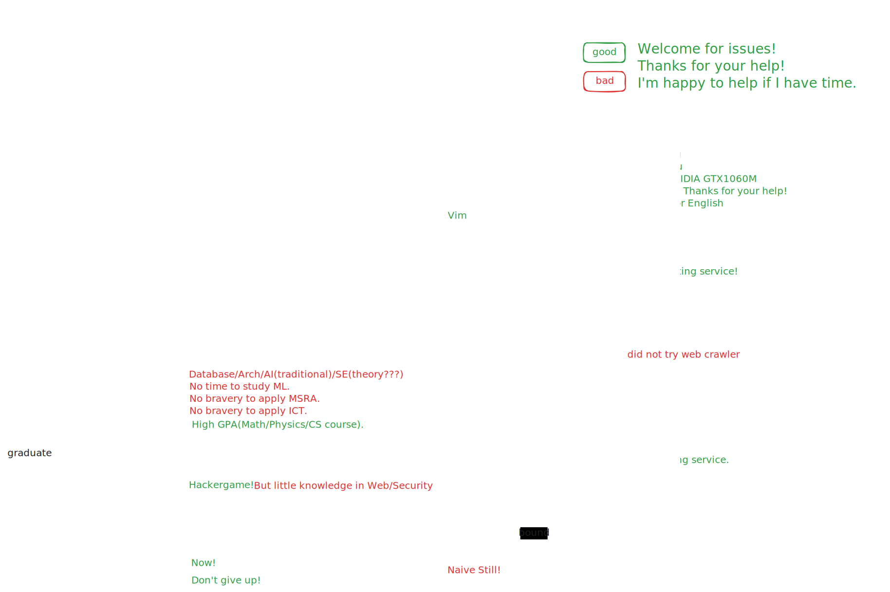

I'm Lslightly, a CS graduate at USTC. I have broad interests and I just seek time to start them or I have not found available resources to do them.

## Beliefs

- Believe Myself.
- Coding and Practice.
- Keep Improving like Vim.
    - searching, evaluation, executing and English.
- Offer Helps and Make Sense.
- Cooperation creates. Races have no winners.
- Seeking/Creating the Good in Life.

## Knowledge

Operating System:

Programming Languages:

- Familiar:

  
- Learning:
  - Lean4

- Known parts of CS(green hand):
  - Compiler(traditional)
  - Arch
  - Database
  - AI(<=2010, that is searching, constraint solvers and traditional ML methods)
  - Formal Methods(few concepts)
- Unknown parts of CS:
  - Web(Crawler, Browser, Frameworks)
  - OS(know few concepts)
  - Distributed System
  - Security(know few concepts)
  - Reinforcement Learning
  - Software Engineering(know few concepts)
  - MLSys(only CUDA Tutorial)
  - Big Data Algorithm
  - Deep Learning
  - Graphics
  - Advanced Data Structures(No OI experience)
  - Network(know few concepts)
  - Verification(Coq, Lean, Type Theory)
- Workflows:
  - VSCode
  - Obsidian+Excalidraw+Git
  - Overleaf

> Not so good at command line and know a little bit.

Frameworks:

Ehhhh...

## MyStory

After graduation, I got emo because I thought I didn't find my value. But actually it was there: trying new things and some practical tools.

If you like, see my github [profile](https://github.com/Lslightly) and [resume](https://github.com/Lslightly/resume), which is promising to be enriched. I am also learning courses at [Lslightly-courses](https://github.com/Lslightly-courses).



